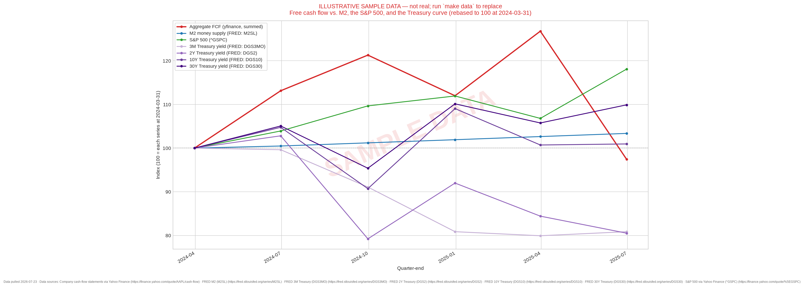

# fcf-macro-indicators

Free cash flow vs. the macro backdrop.

Takes the quarterly **free cash flow** of a basket of large public companies
(Apple, Microsoft, Alphabet, Amazon, Meta by default), sums it into one
"aggregate FCF" series, and plots it against the macro variables it is usually
discussed alongside — **M2 money supply**, the **S&P 500**, and the Treasury
yield curve at four terms (**3-month, 2-year, 10-year, 30-year**). Every series
is rebased to 100 at a common anchor quarter, so the chart shows how corporate
cash generation has moved *relative to* liquidity, equity prices, and the cost of
money across the term structure.



## Usage

Render both charts from the committed `data/series.csv` (offline):

```sh
make          # build output/fcf-macro-indicators.{html,png} from the committed data/
make open     # build, then open the zoomable chart in a browser
make test     # run the tests
make data     # refetch yfinance + FRED into data/series.csv (requires internet), then rebuild
```

`uv` creates this project's `.venv` on first run. Targets follow the repo
standard — see the [repo README](../README.md).

The script can also be driven directly — pick the anchor quarter, or a different
basket via `make data`:

```sh
.venv/bin/python src/plot_fcf_macro.py -o output/chart.html --rebase-date 2024-06-30
.venv/bin/python src/fetch_data.py --tickers AAPL,MSFT,NVDA,GOOGL
```

## Zoomable chart

`make` writes a self-contained page (plotly from CDN). Open it in a browser and:

- **drag** a region to zoom, **scroll** to zoom, **double-click** to reset
- use the **range slider** under the axis
- toggle **Linear / Log** on the y-axis
- click legend entries to hide or isolate a series; hover for aligned values

## Layout

| Path | What it is |
| --- | --- |
| `src/fetch_data.py` | Network step (`make data`): pulls FCF + macro series into `data/series.csv` |
| `src/plot_fcf_macro.py` | Offline build: renders `output/fcf-macro-indicators.{html,png}` from the CSV |
| `data/series.csv` | Committed quarterly grid: `m2`, `sp500`, `dgs3mo/2/10/30`, and one `fcf_<TICKER>` column per basket member |
| `output/fcf-macro-indicators.html` | Zoomable chart (committed so it works without a build) |
| `output/fcf-macro-indicators.png` | Static chart |

## Data sources

- **Free cash flow** — company quarterly cash-flow statements via
  [Yahoo Finance](https://finance.yahoo.com/quote/AAPL/cash-flow) (`yfinance`).
  Uses the reported "Free Cash Flow" line where present, otherwise
  Operating Cash Flow + Capital Expenditure.
- **M2 money supply** — [FRED `M2SL`](https://fred.stlouisfed.org/series/M2SL).
- **Treasury yields** — FRED constant-maturity series
  [`DGS3MO`](https://fred.stlouisfed.org/series/DGS3MO),
  [`DGS2`](https://fred.stlouisfed.org/series/DGS2),
  [`DGS10`](https://fred.stlouisfed.org/series/DGS10),
  [`DGS30`](https://fred.stlouisfed.org/series/DGS30).
- **S&P 500** — level via [Yahoo Finance `^GSPC`](https://finance.yahoo.com/quote/%5EGSPC).

`make data` writes all of them into `data/series.csv`, which is committed so
`make` renders offline and reproducibly.

## Caveats

- **Short history.** yfinance returns only ~5 quarters of cash-flow statements
  per ticker, so the charted window is a handful of quarters — enough to compare
  recent moves, not to draw long-run conclusions. This is the binding constraint,
  and it is why the whole grid is quarterly and the macro pull starts recently.
- **Rebasing yields.** The Treasury series are rebased to 100 like everything
  else, so they show *relative change in the yield level*, not basis points. A
  line at 120 means that yield is 20% higher than at the anchor (e.g. 4.8% vs
  4.0%), not 20 points of yield.
- **Aggregate composition.** Aggregate FCF is summed only over quarters where
  *every* basket member reports, so the line never jumps because a company
  entered or left the sample. Fiscal-quarter report dates are snapped to the
  nearest calendar-quarter-end to share one grid; companies with off-calendar
  fiscal quarters (e.g. Microsoft) are aligned to calendar quarters, not their
  own fiscal ones.
- **FCF is lumpy and seasonal.** A single quarter's FCF swings with working
  capital, buyback-driven capex timing, and seasonality; it is not deseasonalised.
- Not investment advice; the numbers are point-in-time yfinance/FRED pulls and
  are not restated for later revisions.
