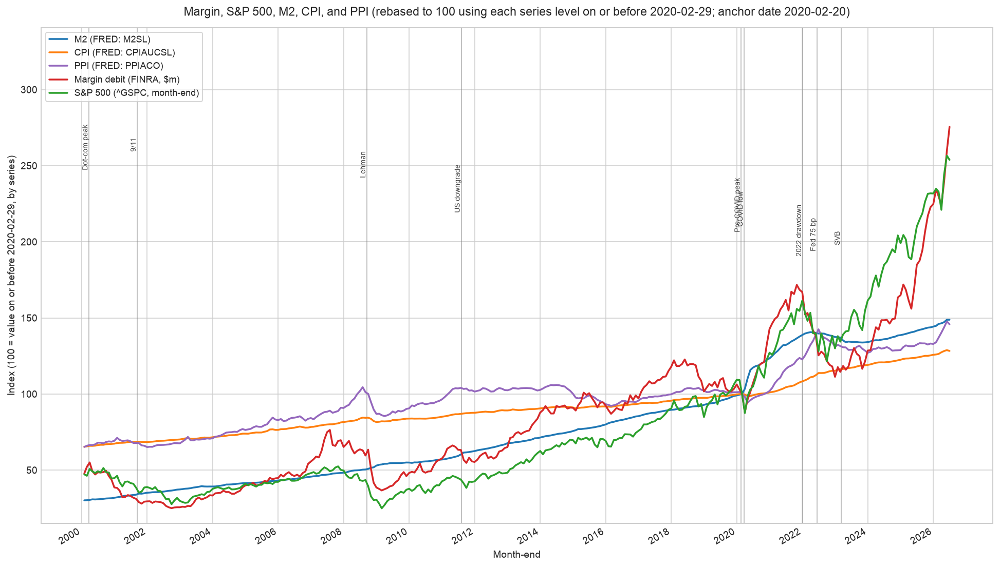

# margin-sp500-m2-visualization

Download FINRA margin debit balances, FRED M2 / CPI / PPI, and S&P 500 levels,
align them on a monthly grid from 2000 onward, rebase every series to 100 using a
configurable anchor date, and plot the result with vertical markers for major
market events.



## Usage

Run everything (generate both the static and the zoomable chart):

```sh
make all
```

Dependencies come from the repo-level virtualenv at `../.venv`, which every
target creates on demand with `uv sync` — see the [repo README](../README.md).

Other targets:

- `make plot` — render the static plot to `output/margin_sp500_m2_2000.png`
- `make html` — render the zoomable plot to `output/margin_sp500_m2_2000.html`
- `make test` — run the unit tests
- `make clean` — remove the generated output

The output format follows the file extension, so the script can also be driven
directly:

```sh
../.venv/bin/python src/plot_macro_series.py -o output/chart.html --rebase-date 2008-09-15
```

## Zoomable chart

`make html` writes a self-contained page (plotly from CDN). Open it in a browser
and:

- **drag** a region to zoom, **scroll** to zoom, **shift-drag** to pan
- **double-click** to reset the view
- use the **range slider** under the axis, or the **1y / 5y / 10y / All** buttons
- toggle **Linear / Log** on the y-axis
- click legend entries to hide or isolate a series; hover for aligned values

## Data sources

- **FINRA** margin statistics (debit balances) — `margin-statistics.xlsx`
- **FRED** — M2, CPI, PPI series via `fredgraph.csv`
- **S&P 500** levels via `yfinance`

All data is fetched live at run time; nothing is committed under `data/`.
