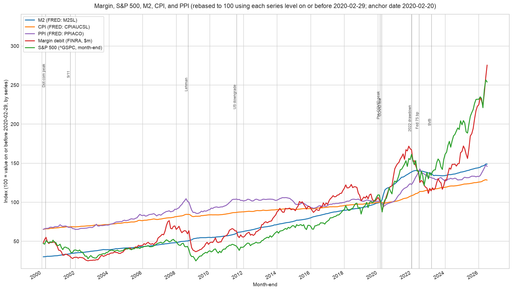

# margin-sp500-m2-visualization

Download FINRA margin debit balances, FRED M2 / CPI / PPI, and S&P 500 levels,
align them on a monthly grid from 2000 onward, rebase every series to 100 using a
configurable anchor date, and plot the result with vertical markers for major
market events.



## Usage

Render both charts from the committed `data/series.csv` (offline):

```sh
make
```

`uv` creates this project's `.venv` on first run. Targets follow the repo
standard — see the [repo README](../README.md):

- `make` — render `output/margin-sp500-m2-visualization.{html,png}` from `data/series.csv`
- `make data` — refetch FINRA / FRED / Yahoo into `data/series.csv`, then re-render
- `make test` — run the unit tests
- `make open` — open the zoomable chart
- `make clean` — remove the generated output

The output format follows the file extension, so the script can also be driven
directly:

```sh
.venv/bin/python src/plot_macro_series.py -o output/chart.html --rebase-date 2008-09-15
```

## Zoomable chart

`make html` writes a self-contained page (plotly from CDN). Open it in a browser
and:

- **drag** a region to zoom, **scroll** to zoom, **shift-drag** to pan
- **double-click** to reset the view
- use the **range slider** under the axis, or the **1y / 5y / 10y / All** buttons
- toggle **Linear / Log** on the y-axis
- click legend entries to hide or isolate a series; hover for aligned values

## Data sources

- **FINRA** margin statistics (debit balances) — `margin-statistics.xlsx`
- **FRED** — M2, CPI, PPI series via `fredgraph.csv`
- **S&P 500** levels via `yfinance`

`src/fetch_data.py` (`make data`) pulls all three into `data/series.csv`, which
is committed so that `make` renders offline and reproducibly.
